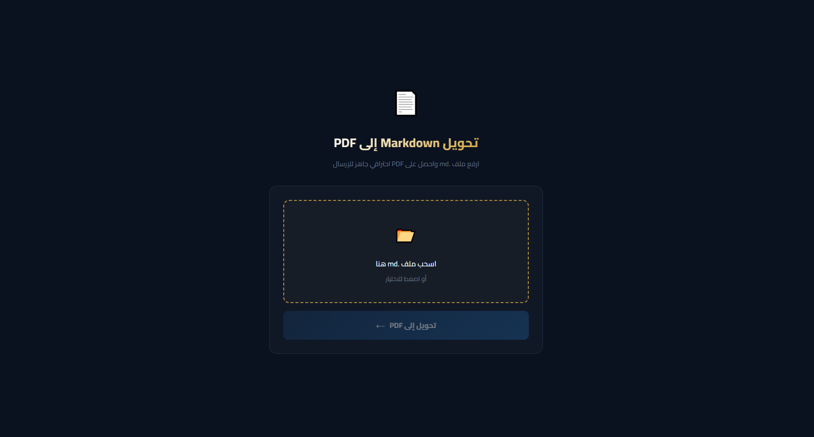
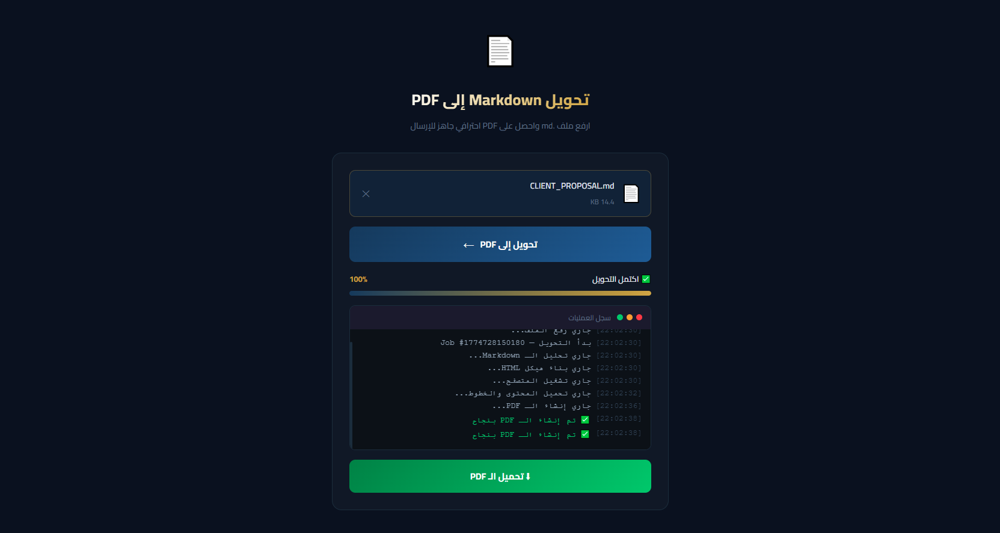

<div dir="rtl">

# MD → PDF Converter

تحويل ملفات Markdown إلى PDF باحترافية، مع دعم كامل للعربية وواجهة RTL ونظام حفظ ملفات للمستخدمين.

---

## Demo

[https://md.futuresolutionsdev.com](https://md.futuresolutionsdev.com/)

---

## Screenshots





---

## المميزات

- **رفع سهل للملفات** عبر السحب والإفلات أو الاختيار المباشر من المتصفح.
- **تتبع حي للتحويل** عبر SSE مع progress bar وسجل رسائل أثناء التحويل.
- **حفظ الملفات للمستخدمين** مع صفحة `files` لعرض الملفات المحفوظة وإدارتها.
- **تنزيل داخل الصفحة** للملفات المحفوظة مع مؤشر تقدم داخل الصف نفسه، بدون فتح تبويب أو صفحة جديدة.
- **دعم عربي كامل** مع RTL وخط Cairo وتنسيق مناسب للمحتوى العربي.
- **تنسيق PDF احترافي** للعناوين والجداول وكتل الأكواد والاقتباسات.
- **الاحتفاظ باسم الملف** بحيث يخرج الـ PDF باسم مناسب مشتق من الملف الأصلي.

---

## Tech Stack

| Layer | Technology |
|-------|-----------|
| Runtime | [Bun](https://bun.sh) |
| Framework | [Hono](https://hono.dev) |
| PDF Engine | [Puppeteer Core](https://pptr.dev) |
| Markdown Parser | [markdown-it](https://markdown-it.github.io) + anchor + TOC |
| Storage | SQLite + ملفات PDF محلية داخل `storage/` |
| Frontend | HTML + CSS + Vanilla JavaScript |

---

## التشغيل السريع

### المتطلبات

- [Bun](https://bun.sh)
- متصفح Chromium / Google Chrome / Microsoft Edge متاح على الجهاز
- يمكن ضبط `CHROME_PATH` إذا لم يتم اكتشاف المتصفح تلقائياً

### التثبيت

```bash
bun install
```

### التشغيل

```bash
bun run start
```

للتشغيل أثناء التطوير:

```bash
bun run dev
```

وللتشغيل عبر PM2:

```bash
pm2 start ecosystem.config.js
```

افتح المتصفح على:

```text
http://localhost:3050
```

يمكن تغيير المنفذ عبر المتغير:

```bash
PORT=3050
```

---

## ملاحظات مهمة عن Chromium

التطبيق يعتمد على Puppeteer Core، لذلك يجب أن يكون Chrome / Edge / Chromium مثبتاً على الخادم أو الجهاز الذي يشغّل التطبيق. إذا لم يتم العثور عليه تلقائياً، عيّن:

```bash
CHROME_PATH=/path/to/chrome
```

على Windows يمكن أن يعمل تلقائياً مع:

- `C:\Program Files\Google\Chrome\Application\chrome.exe`
- `C:\Program Files\Microsoft\Edge\Application\msedge.exe`

---

## هيكل المشروع

```tree
md-to-pdf/
├── server.js                 # Hono server + routes + SSE + download endpoints
├── convert.js                # Markdown → HTML → PDF
├── auth.js                   # الجلسات والمصادقة
├── files.js                  # منطق الملفات المحفوظة والتخزين
├── db.js                     # الاتصال بقاعدة البيانات
├── public/
│   ├── assets/
│   │   ├── css/
│   │   └── js/
│   └── pages/
│       ├── convert.html
│       ├── files.html
│       ├── login.html
│       └── register.html
├── src/
│   └── i18n/                 # ملفات الترجمة
├── uploads/                  # ملفات التحويل المؤقتة
├── storage/                  # ملفات PDF المحفوظة للمستخدمين
├── screenshots/
├── ecosystem.config.js
└── package.json
```

---

## API Endpoints

### التحويل والتنزيل المؤقت

| Method | Endpoint | الوصف |
|--------|----------|-------|
| `POST` | `/convert` | رفع ملف `.md` وبدء التحويل، ويرجع `{ jobId }` |
| `GET` | `/stream/:jobId` | SSE stream للـ progress والـ logs |
| `GET` | `/download/:jobId` | تنزيل الـ PDF بعد اكتمال التحويل |

### المصادقة

| Method | Endpoint | الوصف |
|--------|----------|-------|
| `POST` | `/api/auth/register` | إنشاء حساب جديد |
| `POST` | `/api/auth/login` | تسجيل الدخول |
| `POST` | `/api/auth/logout` | تسجيل الخروج |
| `GET` | `/api/auth/me` | جلب بيانات المستخدم الحالي |

### الملفات المحفوظة

| Method | Endpoint | الوصف |
|--------|----------|-------|
| `POST` | `/api/files/save/:jobId` | حفظ ملف PDF الناتج ضمن ملفات المستخدم |
| `GET` | `/api/files` | جلب قائمة الملفات المحفوظة |
| `GET` | `/api/files/:id` | جلب بيانات ملف محفوظ واحد |
| `GET` | `/api/files/:id/download` | تنزيل ملف محفوظ مع `Content-Length` ومؤشر تقدم داخل الصفحة |
| `DELETE` | `/api/files/:id` | حذف ملف محفوظ |
| `GET` | `/api/storage` | جلب حالة التخزين وعدد الملفات |

---

## الحدود الحالية

- **الحد الأقصى لحجم الملف المرفوع:** `10 MB`
- **الحد الأقصى للملفات المحفوظة لكل مستخدم:** `20` ملفاً
- **الحد الأقصى للتخزين لكل مستخدم:** `100 MB`
- **تنظيف ملفات التحويل المؤقتة:** بعد `10` دقائق تقريباً

---

## سلوك صفحة الملفات

صفحة `files` تدعم حالياً:

- عرض الملفات المحفوظة مع الاسم والتاريخ والحجم.
- تنزيل الملف المحفوظ بدون navigation.
- إظهار progress bar داخل صف الملف أثناء التنزيل.
- حذف الملفات مع نافذة تأكيد.
- عرض حالة التخزين المستخدمة وعدد الملفات.

---

## تخصيص تنسيق الـ PDF

تنسيق الـ PDF موجود داخل `convert.js` في كتلة الـ `<style>`، ويتضمن:

- `h1` بخلفية متدرجة
- `h2` و`h3` بتنسيق عربي واضح
- جداول مناسبة للطباعة
- دعم `blockquote`
- تنسيق خاص لكتل الأكواد

---

## ملاحظات

- التطبيق يعتمد على اتصال إنترنت إذا كنت تستخدم خطوطاً أو أصولاً خارجية أثناء التصيير.
- مسار `/download/:jobId` خاص بنتيجة التحويل المؤقتة.
- مسار `/api/files/:id/download` خاص بالملفات المحفوظة للمستخدمين.

</div>
